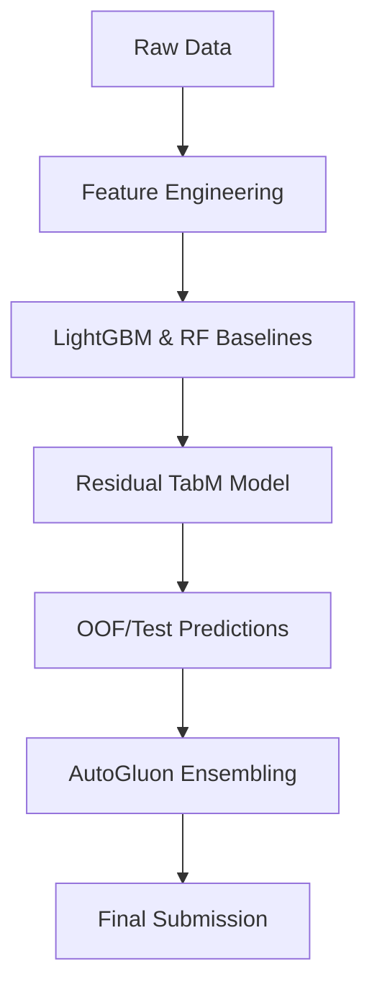

# 🚗 Road Accident Rate Prediction

[](https://www.python.org/)
[](https://jupyter.org/)
[](LICENSE)
[](https://github.com/microsoft/LightGBM)
[](https://auto.gluon.ai)

> Forecasting **road accident risk rates** from traffic and environmental data using advanced tabular ML techniques (LightGBM, Random Forest, TabM, and AutoGluon).

---

## 🧭 Overview

This repository contains a collection of experiments designed to predict **road accident rates** based on tabular datasets of environmental and traffic-related variables.  
It began as a **Kaggle-style competition** and evolved into a study of ensemble and residual modelling pipelines.

📊 The workflow explores:
- **Feature engineering & EDA**
- **Tree-based baselines (LightGBM, Random Forest)**
- **Residual tabular stacking**
- **AutoML benchmarking with AutoGluon**

---

## 📁 Repository Structure

| File / Folder | Description |
|:--------------|:------------|
| 📘 `GBM_RF_Road_Accident_Rate.ipynb` | Baseline notebook – EDA, feature engineering, and tree-based models. |
| 📗 `model3_tabm_residual.ipynb` | Residual modelling pipeline using TabM and OOF evaluation. |
| 📙 `autogluon.ipynb` | AutoML benchmark via AutoGluon for rapid leaderboard comparison. |
| 📄 `submission_*.csv` | Kaggle-style final predictions. |
| 📄 `oof_*.csv`, `test_*.csv` | Out-of-fold and test predictions for stacking and ensemble evaluation. |
| ⚙️ `requirements.txt` | (Optional) Python dependencies list. |

> **Note:** Raw data (`train.csv`, `test.csv`) are managed with **[Git LFS](https://git-lfs.github.com/)** due to size.  
> Use `git lfs install && git lfs pull` after cloning.
---

## 🚀 Getting Started

### 1️⃣ Create your environment
```bash
conda create -n road_accident python=3.10
conda activate road_accident
```

### 2️⃣ Install dependencies
```bash
pip install pandas numpy scikit-learn matplotlib seaborn lightgbm autogluon.tabular
# or use the provided requirements.txt
pip install -r requirements.txt
```

### 3️⃣ Launch Jupyter
```bash
jupyter lab
```

### 4️⃣ Run the notebooks
Open any of the `.ipynb` files to reproduce experiments, adjust features, or rerun training.

---

## 🧪 Reproducing Results

| Notebook | Purpose | Output |
|:----------|:---------|:--------|
| `GBM_RF_Road_Accident_Rate.ipynb` | Builds baseline GBM/RF models with feature engineering and target encoding. | `oof_baseline.csv`, `test_baseline.csv` |
| `model3_tabm_residual.ipynb` | Trains residual TabM model and generates refined predictions. | `submission_tabm.csv` |
| `autogluon.ipynb` | Benchmarks performance via AutoML sweep. | `submission_autogluon.csv` |

📁 All intermediate outputs (OOF/test/submission files) are versioned for easy ensembling and auditing.

---

## 🧠 Example Model Flow



---

## 📈 Performance Highlights

| Model | RMSE (Leaderboard) | Notes |
|:------|:-------------------|:------|
| LightGBM | ~0.056 | Strong baseline, interpretable |
| TabM Residual | **0.0554** | Best performing stacked model |
| AutoGluon Ensemble | 0.0555 | Competitive automated benchmark |

---

## 🤝 Contributing

Contributions are welcome!  
💡 Ideas for improvement:
- Try CatBoost or XGBoost residuals  
- Experiment with cross-validation folds  
- Visualize feature importances or SHAP values  

To contribute:
1. Fork the repo  
2. Create a new branch  
3. Submit a pull request  

---

## 📜 License

This project is licensed under the [MIT License](LICENSE).

---

## 🌟 Acknowledgements

- Kaggle dataset organizers for the competition data  
- Libraries: `pandas`, `numpy`, `scikit-learn`, `lightgbm`, `autogluon.tabular`  
- Visualization: `matplotlib`, `seaborn`
